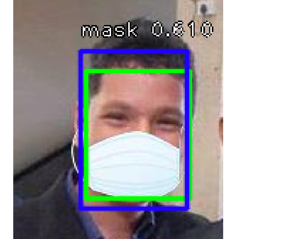
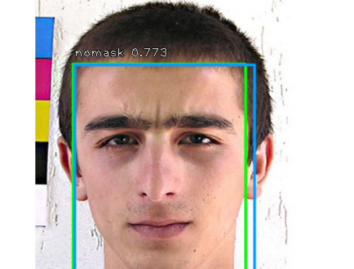

# RetinaNet_mask
RetinaNet detects two classes of face - 0)with mask 1)without mask

Green rectangle is ground truth

Other color is detection

## Virtual env
virtualenv venv3 --python=python3
source venv3/bin/activate
pip3 install jupyter notebook

jupyter notebook

Run RetinaMask.ipynb

Press shift+enter to execute cells

